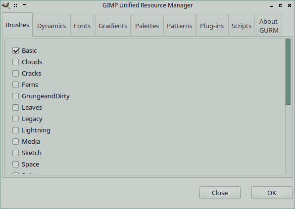

# GURM
**GIMP Unified Resource Manager**

A GIMP plug-in script to manage installed resources:

* Brushes
* Dynamics
* Fonts
* Gradients
* Palettes
* Patterns
* Plug-ins
* Scripts

The idea for GURM is based on the Brush Manager by Sean Bogie, and developed
as [GURM v0.7](http://registry.gimp.org/node/13473) by Sagenlicht, from [Cartographers Guild](http://cartographersguild.com)

It was further developed as [GURM v0.8](http://gimpscripts.com/2012/10/gurm-gimp-unified-resource-manager/), specifically for
Windows, by Steve Bush. This is the version that I have modified for Linux: bugfixes, cleaned the code, made the user
settings simpler.
